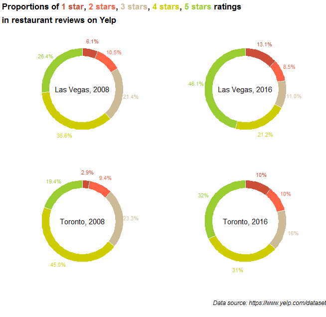

This is a thoughtful visualization, and I appreciate how it is written in R rather than Matplotlib - the appearance is strikingly different from plots we've created and reviewed so far in the class. I think it even manages to justify its use of the much-maligned pie/donut chart.

Elements that strike me positively are the legend embedded in the title, the color scheme, the simplicity, and the symmetry. I also appreciate the choice of data set - it is current, playful, and still related to cities and the class curriculum.

Points that I would adjust include the typesetting and general rendering - it is a bit pixelated and the 3-star review labels are incorrectly padded. I wish there was a caption with analysis and more information about the construction of the plot. 

If you read through the script, the student has selected the two cities by the number of reviews. But it's not clear just from the markdown file why Las Vegas and Toronto are being used. The student actually did more work than they acknowledge. In addition, the plots actually capture something fascinating: the polarization of reviews, moving from a fairly even mix of ratings to a higher grouping of extreme ratings (1s and 5s). Next time, the student could even include a measure to quantitatively describe that effect: https://en.wikipedia.org/wiki/Herfindahl_index.

Overall, really nice. And I'm actually surprised Las Vegas has that many 5-star ratings. So I learned something from this.
